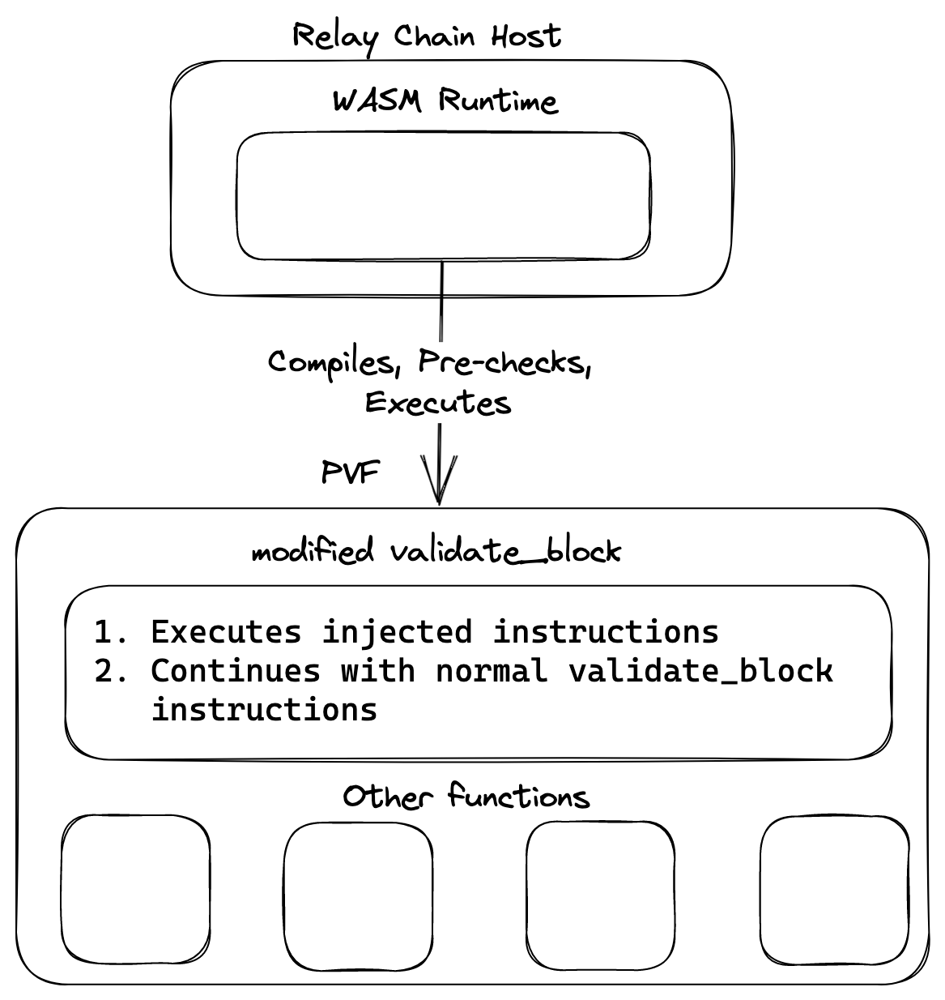

# Milestone 1 - Polkadot Conformance Testing Suite Solution Design

# Background

The Parachains protocol is a key part of the Polkadot network that allows the execution of Parachain Validation Functions (PVFs). PVFs are wasm blobs that export `validate_block` function that is run by validators. It checks the validity of the inputs from collators. Since Polkadot Host implementations execute the PVFs, they have to follow some deterministic limits on various aspects, such as stack depth, memory usage, execution time, and compilation/preparation time. This document designs a conformance testing suite that checks whether these limits are met by different Host implementations, versions, hardware configurations and OS configurations. 

The document explains the main characteristics and components of the suite, the testing methodology and procedures, the expected outcomes and benefits, and the challenges and limitations of the approach. Additionally, the document provides initial test cases and results, as well as recommendations for future improvements and extensions of the suite.

# Testing strategy

PVF is the current runtime wasm for a Parachain that is stored on the Relay chain. When a collator produces a new block, it sends a "Proof of Validity" (PoV) block to the Relay chain validator. This PoV is a Parachain block with witness data. The validator uses this PoV block along with the PVF and performs a series of checks, including executing PVF’s `validate_block` against the PoV. This process is referred to as "candidate validation" - it determines whether a Parachain block is a successful candidate to be a block for that Parachain. Based on the candidate validation result, the Parachain block will either be dismissed or promoted to a real Parachain block.

Since the candidate validation process can have different implementation details, such as programming language and wasm runtime environment, it is not reliable to directly invoke the candidate validation process, PVF prechecks, or execution. Additionally, the candidate validation process is not designed to be called in isolation like the Host and Runtime APIs. A conformance testing suite should be Host-agnostic and not depend on implementation details. Coupling the suite with each Host implementation would lead to high maintenance costs.

A more sensible approach is to execute the candidate validation as it would run during normal node operation and assert the behaviour and progress of the Parachain and Relay chain. This solution focuses on the overall outcome rather than the specific intricacies of candidate validation in each Host. By treating the process as a black box, a more reliable and maintainable strategy is achieved. To deliver a customizable, extensible, and reusable solution, the conformance suite will use some of Parity's existing tooling, such as [Zombienet](https://github.com/paritytech/zombienet), [partity-wasm](https://github.com/paritytech/parity-wasm) crate and follow the AAA principle.

### Modify `validate_block` inside the PVFs

In the "arrangement" step, the team will develop a tool capable of replacing the **`validate_block`** function with a modified one. The modified code could be anything that would cause the Relay chain's PVF compile, pre-check, and execute algorithm to fail. For example, the modifications will include:

- Allocating a large amount of heap memory
- Allocating a large amount on the stack
- Sleeping for N milliseconds
- Increasing compilation time

To achieve this functionality, the team will prepend the custom code at the start of the `validate_block` function. This allows subsequent assertion that conforming Hosts do allow the Parachain to make progress, while non-conforming Hosts are not able to make progress.

### Start a para and Relay chain network with the modified PVF

Zombienet allows users to configure and spawn a substrate-based network in a customizable and reliable way. There are existing [Polkadot PVF tests](https://github.com/paritytech/polkadot/blob/d0419a924137f4b15ec9a2e76d2a44cc6330ce42/zombienet_tests/functional/0001-parachains-pvf.zndsl) and [Gossamer integration tests](https://github.com/ChainSafe/gossamer/pull/3192) that already do that.

Our team believes that Zombienet is a great tool for conformance testing because it allows is to abstract away Host details and focus on the chain’s operation:

- Host implementation can be easily configured using the `command` parameter.
- The modified PVF from the previous step can be loaded using `genesis_wasm_path`  parameter.
- If test cases require a custom-tailored blockchain setup, Zombienet provides a lot of configuration options that further solidify the scalability properties of the conformance testing suite.

### Assert Parachain’s and Relay Chain’s progress

Integration with Zombienet can occur in multiple projects and across most Host implementations. By utilizing Zombienet's DSL, we can reliably verify the behaviour of both validators and collators.

A non-exhaustive list of metrics that we can use to assert:

- `parachain X block height is at least Y within Z seconds`
- `log line contains`
- `system event contains`

The next two metrics are currently specific to Polkadot and allow for more accurate verification of the preparation and execution time of PVFs. It should be noted that at the time of writing, Kagome does not support these logs. However, there are plans to [add them](https://github.com/soramitsu/kagome/issues/1608), using Polkadot's logic as a reference. Until they are implemented, our team will have to rely on the basic metrics mentioned above to verify Kagome’s behaviour.

- `polkadot_pvf_preparation_time` - Time spent in preparing PVF artifact in seconds
- `polkadot_pvf_execution_time` - Time spent in executing PVF

# Limits and initial scope of the testing suite

## Host Scope

Different Host implementations have varying feature and protocol support. Consequently, some of them will not be included in the initial conformance testing suite, or their testing accuracy will be limited.

### Polkadot

Polkadot provides complete support for Parachains and metrics. It will be the implementation that our team will be using as a complete Parachain protocol reference.

### Kagome

Kagome also supports Parachain protocol. However, it currently lacks some of the metrics mentioned above, which prevents us from verifying PVF execution and preparation time. This limitation is not a major obstacle, as the progress of Parachains can still be verified using other methods such as logs and system events. Once Kagome adds PVF-specific metrics, the conformance test cases can be expanded to include them for Kagome as well.

### Gossamer

At the time of writing, Gossamer does not support the Parachain protocol. Therefore, it will not be included in the initial testing scope. However, in the future, the testing suite should be easily expandable to include Gossamer, as long as it follows the example set by Polkadot and Kagome.

## Limits

Our team examined Polkadot and Kagome to identify any enforced limits. Polkadot offers comprehensive support for Parachain protocol and provides well-defined limitations along with the reasoning behind them. Although Kagome supports Parachains, its limitations are not as comprehensive as those of Polkadot. Therefore, we have decided to adhere to the limitations defined by Parity in Polkadot and use them as the basis for the conformance tests. We believe that Parity's team has invested significant effort in developing and improving the Parachain protocol, making them the authority on what is acceptable for the protocol. If the conformance suite encounters a scenario where the limits need adjustment, it can be easily done, and the tests can be rerun against each Host implementation. Such changes are natural as the protocol evolves.

| Limit | Compilation time | Execution time | Stack depth | Memory allocation |
| --- | --- | --- | --- | --- |
| Max. allowed value | 10s | 2s | 65536 bytes | 2080 pages(64kb each) |

Since compilation and execution time can be affected by system resources, node load and other environmental or timing factors, these test can be flaky. The PVFs for these scenarios will have enough performance overhead to ensure that the test are running reliably.

# Testing scenarios

## **Test Scenario: Compilation Time**

### **Description**

This test scenario aims to evaluate the compilation time of the PVF within each Host and verify that the Host's compilation limits are respected. It tests the behaviour when the compilation process meets the conformance suite’s limits and ensures that the Host can handle various compilation scenarios efficiently.

### **Inputs**

- PVF Byte Code: The byte code of the PVF to be compiled by the Host.
- Compilation Limit: The specific compilation time limit expected by the conformance suite on the Host.

### Actions

1. Write .zndsl test for the specific test case.
2. Inject PVF’s `validate_block` function or bloat the whole PVF in order to increase compilation time and resources.
3. Configure Zombienet network’s Parachain to use the modified PVF.
4. Start network with specified parameters.
5. Assert behaviour of both chains

### **Expected Outcome**

- The compilation process should complete within a reasonable time frame, adhering to the conformance test’s specified compilation limits.
- If the compilation process exceeds any of the expected limits, the Host should handle it gracefully, either by terminating the compilation or enforcing alternative measures to prevent resource exhaustion or other undesirable outcomes.

### Test Cases

1. Test Case: Popular Parachains’s Compilation within Limits
    - Description: Validate the behaviour when the compilation process remains within the specified limits.
    - Inputs:
        - PVF byte code: Valid PVF byte code of Parachains such as [Statemint](https://parachains.info/details/statemint) and [Acala](https://parachains.info/details/acala_network).
        - Compilation Limit: **10s**
    - Expected Outcome: The compilation process should complete within the specified limits, and the Host should compile the PVF successfully.
2. Test Case: Compilation Time Exceeds Limit
    - Description: Verify the behaviour when the compilation time exceeds the specified limit.
    - Inputs:
        - PVF Byte Code: Complex PVF byte code that requires extensive compilation time.
        - Compilation Limit: **10s**
    - Expected Outcome: The Host should monitor the compilation process and gracefully handle it if it exceeds the specified time limit, preventing excessive resource consumption or prolonged compilation times. Compilation should not affect validator’s normal operation

## **Test Scenario: Execution Time**

### **Description**

This test scenario aims to evaluate the execution time of the PVF within the Polkadot Host and verify that it adheres to the specified execution time limit. The objective is to ensure that the PVF execution completes within the defined time constraint and behaves accordingly.

### **Inputs**

- PVF Byte Code: The byte code of the PVF to be executed by the Host.
- Execution Time Limit: The maximum allowed execution time for the PVF.

### **Actions**

1. Write .zndsl test for the specific test case.
2. Inject PVF’s `validate_block` function with additional stack allocating instructions.
3. Configure Zombienet network’s Parachain to use the modified PVF.
4. Start network with specified parameters.
5. Assert behaviour of both chains

### **Expected Outcome**

- The PVF execution should complete within the specified execution time limit.
- If the PVF execution exceeds the specified limit, the conformance testing suite should handle it gracefully, either by terminating the execution or enforcing alternative measures to prevent excessive resource usage or other undesired outcomes.

### **Test Cases**

1. Test Case: PVF Execution Within Time Limit
    - Description: Validate the behaviour when the PVF execution remains within the specified time limit.
    - Inputs:
        - Execution Time Limit: **2s**
        - PVF Byte Code: Valid PVF byte code.
    - Expected Outcome: The PVF execution should complete within the specified time limit, and the conformance testing suite should report a successful execution.
2. Test Case: PVF Execution Exceeds Time Limit
    - Description: Verify the behaviour when the PVF execution exceeds the specified time limit.
    - Inputs:
        - Execution Time Limit: **2s**
        - PVF Byte Code: PVF code that requires extensive computation or processing.
    - Expected Outcome: The conformance testing suite should monitor the PVF execution and terminate it if it exceeds the specified time limit, preventing excessive resource usage or prolonged execution times. The suite should report the termination as per the defined test result reporting mechanism.
3. Test Case: PVF Execution Approaches Time Limit
    - Description: Test the behaviour when the PVF execution approaches the specified time limit.
    - Inputs:
        - Execution Time Limit: Maximum allowed execution time: X seconds
        - PVF Byte Code: PVF code that consumes a significant amount of execution time.
    - Expected Outcome: The conformance testing suite should monitor the PVF execution and ensure it does not approach or exceed the specified time limit. If the execution time approaches the limit, the suite should handle it appropriately without causing resource exhaustion or other undesirable consequences.

## **Test Scenario: Stack Depth**

### **Description**

This test scenario aims to verify that the Polkadot Host's wasm runtime effectively handles conformance suite’s stack depth limits during wasm execution. It ensures that the Host's operations continue normally even if the stack depth exceeds the limits, while at the same time the Parachain under test is unable to make progress in terms of block production.

### Inputs

- PVF bytecode: The modified wasm bytecode to be executed by the Polkadot Host.

### Actions

1. Write .zndsl test for the specific test case.
2. Inject PVF’s `validate_block` function with additional stack allocating instructions.
3. Configure Zombienet network’s Parachain to use the modified PVF.
4. Start network with specified parameters.
5. Assert behaviour of both chains

### Expected Outcome

- If the Host's wasm execution environment effectively manages the stack depth and catches any exceedance of its limits, the test passes.
- The Host's operations should continue to function normally, while the Parachain should be unable to make progress in terms of block production if the stack depth exceeds the Host's limits.

### Test Cases

1. Test Case: Rococo’s and Moonbeam Stack Depth within Limit
    - Description: Verify the behaviour of popular Parachains’ stack depth remains within the specified limit.
    - Inputs:
        - PVF Byte Code: Valid PVF byte code
    - Expected Outcome: The execution within the Host's wasm execution environment should proceed normally, and the Parachain makes progress in terms of block production.
2. Test Case: Stack Depth Exceeds Host's Limit
    - Description: Validate the behaviour when the stack depth exceeds the Host's specified limit.
    - Inputs:
        - Host Stack Depth Limit: **65536 bytes**
        - PVF bytecode: PVF bytecode designed to exceed the Host’s stack depth limit.
    - Expected Outcome: The execution within the Host's wasm execution environment should catch the stack depth exceedance, stop the wasm execution, and prevent the Parachain under test from making progress in terms of block production. The Host's operations should continue normally.

## **Test Scenario: Memory Allocation**

### **Description**

This test scenario aims to verify that the Polkadot Host's wasm execution environment effectively handles memory allocation during wasm execution. It ensures that the Host's operations continue normally even if the allocated memory exceeds its limits, while the Parachain under test is unable to make progress in terms of block production.

### Inputs

- Memory: The amount of memory to be injected inside PVF’s `validate_block`.
- PVF bytecode: The wasm bytecode to be executed by the Polkadot Host.

### Actions

1. Write .zndsl test for the specific test case.
2. Inject PVF’s `validate_block` function with additional memory allocating instructions.
3. Configure Zombienet network’s Parachain to use the modified PVF.
4. Start network with specified parameters.
5. Assert behaviour of both chains

### Expected Outcome

- If the Host's wasm execution environment effectively manages the allocated memory and catches any exceedance of its limits, the test passes.
- The Host's operations should continue normally, while the Parachain under test should be unable to make progress in terms of block production if the stack depth exceeds the Host's limits.

### Test Cases

1. Test Case: Rococo’s and Moonbeam Allocated Memory within Limit
    - Description: Verify the behaviour of popular Parachains’ the allocated memory remains within the specified limit.
    - Inputs:
        - Host Allocated Memory Limit: No changes
        - PVF Byte Code: No changes will be made to the PVF
    - Expected Outcome: The execution within the Host's wasm execution environment should proceed normally, and the Parachain under test should be able to make progress in terms of block production.
2. Test Case: Allocated Memory Exceeds Host's Limit
    - Description: Validate the behaviour when the allocated memory exceeds the Host's specified limit.
    - Inputs:
        - Host Allocated Memory Limit: **2080 pages**
        - PVF bytecode: PVF bytecode designed to exceed the Host’s stack depth limit.
    - Expected Outcome: The execution within the Host's wasm execution environment should catch the memory exceedance, stop the wasm execution, and prevent the Parachain under test from making progress in terms of block production. The Host's operations should continue normally.

# Challenges

One of the primary challenges that the team will face is determining the appropriate constraints for each type of limit. This task will require ongoing efforts, even after establishing the base conformance suite, as the protocol naturally evolves over time.

Another potential challenge relates to ensuring reliable assertion. Given that the solution operates at a higher level and some test cases rely on the Host emitting custom metrics, there may be difficulties in asserting specific cases or extracting relevant information. This is the case case with `polkadot_pvf_preparation_time` and `polkadot_pvf_execution_time` which currently exist only in Polkadot. As the protocol expands, it may be necessary to expose additional metrics to enable the inclusion of more conformance tests.

# Development path

In the development path of this technical document, we have outlined the key stages necessary for the successful implementation of the PVF (Protocol Verification Framework) project. The development path encompasses the following steps:

### **Step 1: PVF Configurable Mock**

As a critical initial milestone, the team will dedicate significant effort to develop the PVF configurable mock. This step requires careful consideration due to the complexity of injecting instructions into the wasm code. The team will utilize the Parity-wasm crate for efficient WASM deserialization/serialization, ensuring the inclusion of unit tests to enhance the overall reliability of the implementation. The initial PVFs are going to be downloaded from each Parachain’s repository - [Statemint](https://github.com/paritytech/cumulus/releases), [Acala](https://github.com/AcalaNetwork/Acala/releases)

### **Step 2: Foundations of PVF**

Upon successfully injecting instructions into the PVF wasm, the next phase focuses on orchestrating the PVF configuration and establishing the initial Zombiеnet configuration. To streamline the integration with polkadot-tests in milestone 3, the team has chosen to leverage [Julia's](https://docs.julialang.org/en/v1/) capabilities. The Zombienet network structure is designed to be relatively straightforward, consisting of two validators and one collator. However, if specific test cases require a more intricate setup, the team will accommodate those requirements. Existing setups in Polkadot can be leveraged to expedite the configuration process.

### **Step 3: Zndsl Tests**

With the foundation set, the next crucial step involves the creation of zndsl tests. These tests will be divided into two distinct phases. The initial phase, shared among all tests, will validate the proper functioning of validators and collators. Subsequently, specific instructions tailored to each test case will be implemented. The focus will primarily be on verifying the progress or lack thereof in the Relay chain and Parachain, while also ensuring the validation of any custom PVF metrics emitted by the Relay chain Host.

By following this development path, we aim to achieve a robust and functional PVF implementation, demonstrating the reliability and effectiveness of the solution.

### Step 4: Automation

Upon completion of the hard coding phase, the team will shift its focus towards the integration of the existing testing suite into the polkadot-tests repository. This integration process aims to incorporate the developed functionality seamlessly into the broader conformance testing framework. As mentioned above, the team is going to extend the existing Julia scripts in polkadot-tests in order to run the PVF conformance tests as well.